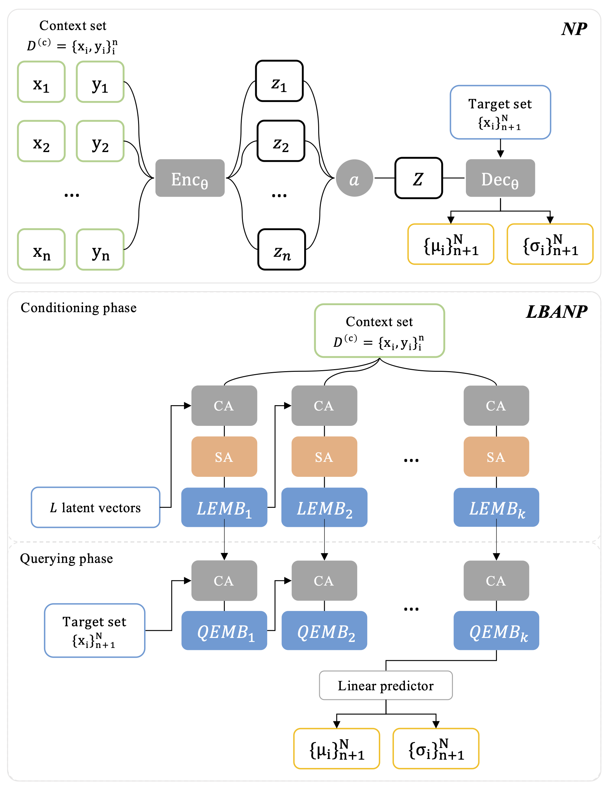
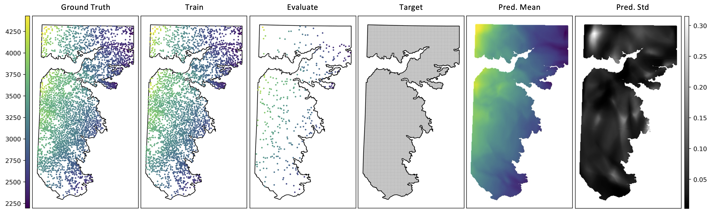

# Neural process for uncertainty-aware geospatial modeling

Pytorch codes for [Neural process for uncertainty-aware geospatial modeling](https://doi.org/10.1145/3687123.3698294).

## Abstract

> Uncertainty-aware geospatial modeling has been a long standing challenge in geographic information science. Conventional geostatistical methods, such as the kriging family of methods, are often used for uncertainty-aware geospatial analysis and modeling but tend to fall short in capturing complex spatial patterns. Spatially explicit deep-learning models have been shown to excel at capturing complex patterns in high-dimensional geospatial datasets, but they often require large amounts of training data, which can be difficult to obtain in practice. In this study, we discuss a meta learning-based approach, namely \textit{Neural Processes} (NP), for uncertainty-aware spatial analysis of small geospatial datasets. By integrating the concepts of deep neural networks, meta-learning, and stochastic processes, NP can capture complex patterns in small datasets while effectively accounting for uncertainty. We adopt a recent development in NP family, the latent bottlenecked attentive neural process (LBANP), and apply it to groundwater availability mapping as a case study. We highlight the performance of the method with a comprehensive comparison with two commonly used deep learning-based Gaussian process regression methods, deep kernel learning and deep Gaussian process.

## Diagram



## Usage

Create a conda environment and install packages:

```shell
conda create -n LBANP python=3.9
conda activate LBANP
pip install -r requirements.txt --extra-index-url https://download.pytorch.org/whl/cu116
```

Start from `main.py` with a specific model name (`LBANP`, `DKL`, `DeepGP`):

```python
# train
python main.py --model_name LBANP --mode train
# eval
python main.py --model_name LBANP --mode eval
# plot
python main.py --model_name LBANP --mode visualize
```

Example: spatial interpolation on the Ogallala groundwater dataset.



## Citation

If this repository is helpful for your projects, please consider citing our papers.

```bibtex
@inproceedings{li2024neural,
  title={Neural process for uncertainty-aware geospatial modeling},
  author={Li, Guiye and Cao, Guofeng},
  booktitle={Proceedings of the 7th ACM SIGSPATIAL International Workshop on AI for Geographic Knowledge Discovery},
  pages={106--109},
  year={2024},
  url={https://doi.org/10.1145/3687123.3698294}
}
```

## Acknowledgement

This code is based on the [official code](https://github.com/BorealisAI/latent-bottlenecked-anp) of [Latent Bottlenecked Attentive Neural Processes](https://arxiv.org/abs/2211.08458). The implementation of baselines is borrowed from the official GPytorch examples: [DeepGP](https://docs.gpytorch.ai/en/v1.10/examples/05_Deep_Gaussian_Processes/Deep_Gaussian_Processes.html) and [DKL](https://docs.gpytorch.ai/en/v1.10/examples/06_PyTorch_NN_Integration_DKL/KISSGP_Deep_Kernel_Regression_CUDA.html).